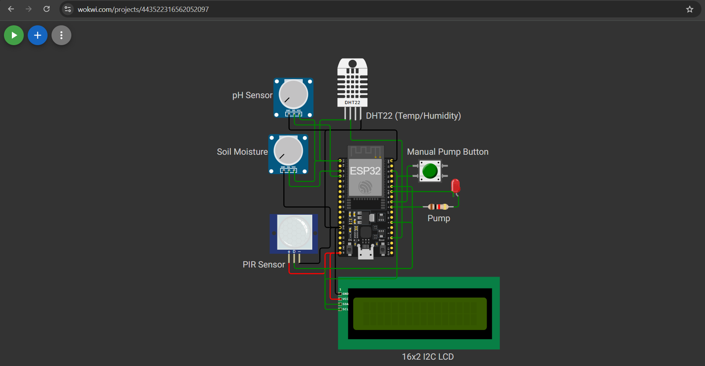
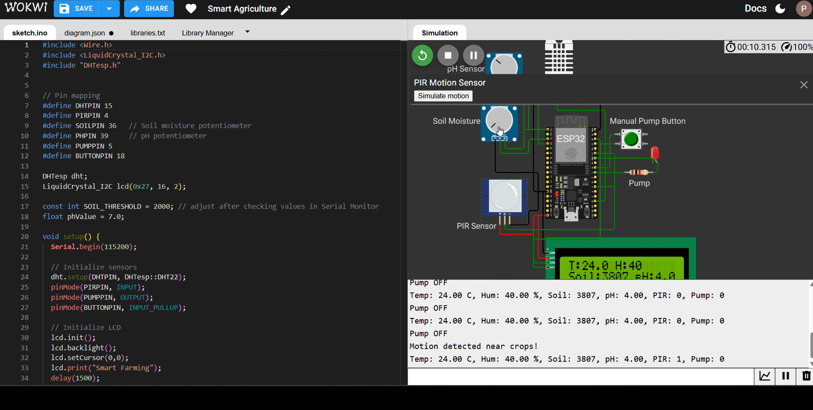

# 🌱 Smart Agriculture Monitoring System (IoT-Based)

## 📌 Overview
This project is an **IoT-enabled Smart Agriculture Monitoring System** designed to help farmers monitor and manage crop conditions.  
The system integrates multiple sensors with an ESP8266/ESP32 microcontroller to provide **real-time monitoring** of soil moisture, pH, temperature, humidity, and animal intrusion.  
It automates irrigation through a **relay-controlled pump** and displays live readings on an LCD.  
Data can also be monitored remotely using IoT platforms like **Blynk**.

---

## ⚡ Features
- 🌡️ Temperature & Humidity monitoring (DHT sensor)  
- 💧 Soil moisture detection with automated irrigation  
- ⚡ Soil pH measurement for fertilizer recommendation  
- 👀 PIR sensor for animal intrusion detection  
- 🖥️ LCD 16x2 display for real-time values  
- 📱 IoT support for remote monitoring (Blynk)  

---

## 🛠️ Components Used
- ESP8266 NodeMCU / ESP32  
- DHT11 / DHT22 Sensor  
- Soil Moisture Sensor  
- pH Sensor  
- PIR Motion Sensor  
- Relay Module + Water Pump  
- LCD Display (I2C 16x2)  
- Push Button (manual pump control)  

---

## 🔄 Working Principle
1. **Sensors** measure soil, pH, temperature, and humidity.  
2. If soil is dry → **pump turns ON automatically** via relay.  
3. pH sensor suggests suitable fertilizer.  
4. PIR detects motion (animal intrusion) and alerts the user.  
5. LCD shows real-time values, and data can be sent to Blynk for remote access.  

---

## 📸 Project Files
- **Presentation** → [Agricultural(IOT).ppt](Agricultural(IOT).ppt)  
- **Circuit Diagram** →   
- **Demo Video** → [Watch Demo](demo.mp4)  
- **Output Screenshot** →   
- **Code** → [project_agriculture.ino](project_agriculture.ino)  

---

## 💻 Code Snippet (Logic)
```cpp
int soil = analogRead(SOILPIN);
float ph = map(analogRead(PHPIN), 0, 4095, 0, 14);
auto data = dht.getTempAndHumidity();

if (soil < 2000) digitalWrite(PUMPPIN, HIGH);
else digitalWrite(PUMPPIN, LOW);

lcd.print("T:"); lcd.print(data.temperature);
lcd.print("Soil:"); lcd.print(soil);
